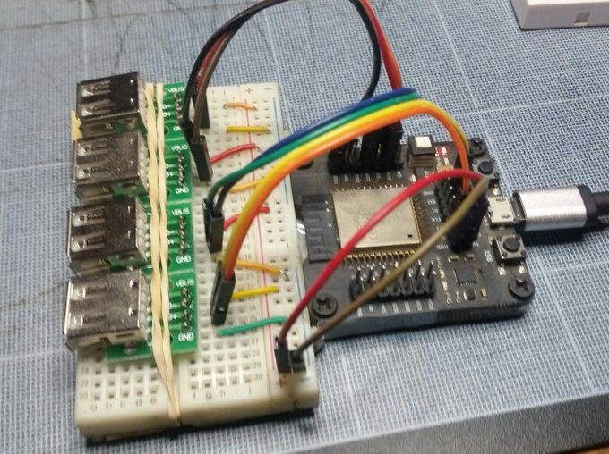

# ESP32 USB Soft Host library for Arduino IDE

What is it?
-----------

This is mainly a wrapper around the excellent work of [Dmitry Samsonov (@sdima1357)](https://github.com/sdima1357)
with [esp32_usb_soft_host](https://github.com/sdima1357/esp32_usb_soft_host)

Some parts of the code (e.g. the timer group isr calls) have been regressed to fit esp-idf 3.3 needs but it has been tested up to 4.4.2.

USB Low Speed is slow
---------------------

ESP32 USB-LS Soft host (:warning: LS=low speed) is a pure software implementation of USB host thru general IO pins.

Features
--------

The library supports up to 4 HID *low speed* devices simultaneously.
A callback can be attached both for detection and events.

Hardware support
----------------

This library has been tested on ESP32-Wroom/Wrover and works fine as long as the pins aren't
shared (beware of the psram pins!).

It has partial support for ESP32-S2, and remains untested on ESP32-S3 && ESP32-C3.

Known working HID devices:
--------------------------

- USB Keyboards: any, but consider powering externally it has backlights and/or other gadgets
- USB Mice:
  - LogiLink ID0062 (idVendor=0x1a2c, idProduct=0x0042): Data recieves - 10/10 , led fired - 10/10;
  - Microsoft Intellimouse 1.1 (idVendor=0x045e, idProduct=0x0039): Data recieves - 10/10, led fired - 10/10
  - Microsoft Wheel Mouse (idVendor = 0x045e, idProduct = 0x0040): Data recieves - 6/10, led fired - 6/10;
  - ASUS Logitech M-UV55A: Data recieves - 7/10 , led fired (complete init?) - 10/10
  - ASUS (Logitech) Optical USB Black #M-UV55A (idVendor = 0x046d, idProduct = 0xc016): Data recieves - 7/10 , led fired (complete init?) - 10/10;
  - A4Tech SWOP-48 (idVendor = 0x093a. idProduct = 0x2510): Data recieves - 10/10 , led fired - 10/10
  - Genius Netscroll 110X (idVendor = 0x0458, idProduct = 0x003a): Data recieves - 10/10, led fired - 10/10
  - Logitech B100 (idVendor=0x046d, idProduct=0xc077): partial detection, may need several resets before events are fired
  - Logitech M-BT83 (idVendor = 0x046d, idProduct = 0xc03e), Data recieves - 5/10, led fired - 5/10;
  - A4Tech X-7??? , gaming mouse w/o label [ VID_09DA&PID_8090&REV_0606&MI_00 ]. Not recognized by driver, no any info in the Serial Monitor exist.
  - A4Tech OP-720 (idVendor = 0x093a, idProduct = 0x2510): Data recieves - 5/10, led fired - 10/10;
  - Oklick-305m: Data recieves - 0/10 (sic!), led fired - 10/10 (i guess it always turned on, independing of init result )
  - Exegate SH-9018: Data recieves - 0/10, led fired - 10/10. Device reaction looks like Oklick-305m

| Status    | Brand         | Model Name       | idVendor  |  idProduct | Init  | Events |              Comments                  |
|:--------- | :------------ | :--------------- |:--------- | :--------- | :-----| :----- | :------------------------------------- |
|:smile:    | LogiLink      | ID0062           | 0x1a2c    | 0x0042     | 10/10 | 10/10  | Low cost 3 buttons mouse               |
|:smile:    | Microsoft     | Intellimouse 1.1 | 0x045e    | 0x0039     | 10/10 | 10/10  |                                        |
|:smile:    | A4Tech        | SWOP-48          | 0x093a    | 0x2510     | 10/10 | 10/10  |                                        |
|:smile:    | Genius        | Netscroll 110X   | 0x0458    | 0x003a     | 10/10 | 10/10  |                                        |
|:no_mouth: | Logitech      | M-UV55A          | 0x046d    | 0xc016     | 10/10 | 7/10   | Brand is advertised as ASUS/Logitech   |
|:no_mouth: | Microsoft     | Wheel Mouse      | 0x045e    | 0x0040     | 6/10  | 6/10   |                                        |
|:no_mouth: | A4Tech        | OP-720           | 0x093a    | 0x2510     | 10/10 | 5/10   |                                        |
|:cold_face:| Logitech      | M-BT83           | 0x046d    | 0xc03e     | 5/10  | 5/10   |                                        |
|:cold_face:| Logitech      | B100             | 0x046d    | 0xc077     | 10/10 | 3/10   |                                        |
|:skull:    | Oklick        | 305m             | n/a       | n/a        | 10/10 | 0/10   |                                        |
|:skull:    | Exegate       | SH-9018          | n/a       | n/a        | 10/10 | 0/10   | Device reaction looks like Oklick-305m |
|:skull:    | A4Tech        | X-7???           | 0x09da    | 0x8090     | 0/10  | 0/10   | Gaming mouse w/o label                 |

- USB Joypads:
  - Quimat QR206 SNES PC Retro Gaming Controller
  - Retrolink USB Classic Super NES Style Controller
  - USB Game Controller (NES Style, unknown brand)

Proof of concept:
-----------------

Credits:
--------
- [Dmitry Samsonov ](https://github.com/sdima1357)
- [Grigory Prigodin](https://github.com/zbx-sadman)
- [@ivo1981](https://github.com/ivo1981)
